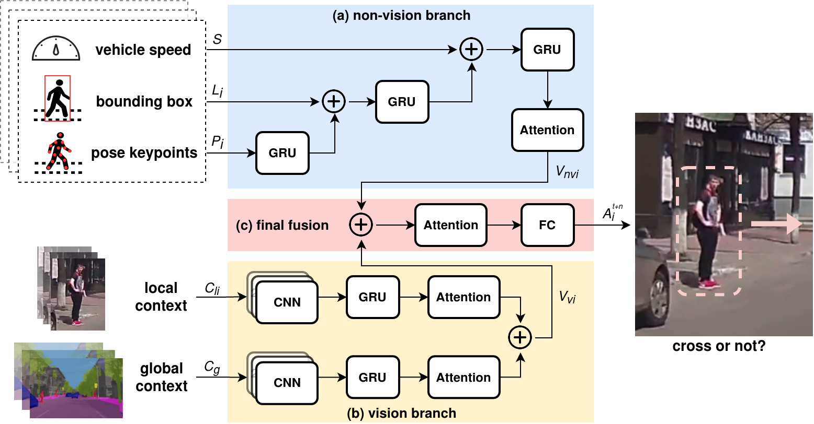

# Pedestrian Crossing Intention Prediction  
  
## Notification  

**Predicting Pedestrian Crossing Intention with Feature Fusion and Spatio-Temporal Attention.**  

<p align="center">

</p>

Paper in ArXiv: https://arxiv.org/pdf/2104.05485.pdf (Accepted to T-IV)  

This work improves the existing pedestrian crossing intention prediction method and achieves the latest state-of-the-art performance.    

Our implementation relied on the pedestrian action prediction benchmark: `Kotseruba, Iuliia, Amir Rasouli, and John K. Tsotsos. "Benchmark for Evaluating Pedestrian Action Prediction." In Proceedings of the IEEE/CVF Winter Conference on Applications of Computer Vision, pp. 1258-1268, 2021.`

## Environment 

```
python = 3.8  
tensorflow-gpu = 2.2   
numpy, opencv, PIL, matplotlib, etc  
CPU:i7-6700K, GPU:RTX-2070super  
```

We recommend using `conda` to create your environment. 

We provide the conda environment's `spec-list.txt` in this repo, in case you want to recover the exact same environment as ours. 

## Dataset Preparation  

Download the [JAAD Annotation](https://github.com/ykotseruba/JAAD) and put `JAAD` file to this project's root directory (as `./JAAD`).  

Download the [JAAD Dataset](http://data.nvision2.eecs.yorku.ca/JAAD_dataset/), and then put the video file `JAAD_clips` into `./JAAD` (as `./JAAD/JAAD_clips`).  

Copy `jaad_data.py` from the corresponding repositories into this project's root directory (as `./jaad_data.py`).  

In order to use the data, first, the video clips should be converted into images. This can be done using script `./JAAD/split_clips_to_frames.sh` following JAAD dataset's instruction.  

Above operation will create a folder called `images` and save the extracted images grouped by corresponding video ids in the `./JAAD/images `folder.  
```
./JAAD/images/video_0001/
				00000.png
				00001.png
				...
./JAAD/images/video_0002/
				00000.png
				00001.png
				...		
...
```
## Training   

Note: our model extracts the semantic mask via DeeplabV3 (you need download pretrained segmentation model [deeplabv3](http://download.tensorflow.org/models/deeplabv3_mnv2_cityscapes_train_2018_02_05.tar.gz) before training and put checkpoint file into this project's root directory (as `./deeplabv3_mnv2_cityscapes_train_2018_02_05.tar.gz`) so that the model can obtain the input semantic data).    

Use `train_test.py` script with `config_file`:
```
python train_test.py -c <config_file>
```

All config_files are saved in `./config_files` and you can review all offered model configs in `./config_files/config_list.yaml` and all offered model architectures in `./model_imgs` corresponding to configs.  

For example, to train MASK-PCPA model run:  

```
python train_test.py -c config_files/ours/MASK_PCPA_jaad_2d.yaml
```  

The script will automatially save the trained model weights, configuration file and evaluation results in `models/<dataset>/<model_name>/<current_date>/` folder.

See comments in the `configs_default.yaml` and `action_predict.py` for parameter descriptions.

Model-specific YAML files contain experiment options `exp_opts` that overwrite options in `configs_default.yaml`.  

Bash scripts are also provided to run train all the models one by one:

- JAAD dataset: `run_all_on_jaad.sh`

```shell
# === run on JAAD datasets ===

# benchmark comparison
python train_test.py -c config_files/baseline/PCPA_jaad.yaml  # PCPA
python train_test.py -c config_files/baseline/SingleRNN.yaml  # SingleRNN
python train_test.py -c config_files/baseline/SFRNN.yaml      # SF-GRU
python train_test.py -c config_files/ours/MASK_PCPA_jaad_2d.yaml  # ours

# ablation study
python train_test.py -c config_files/laterfusion/MASK_PCPA_jaad.yaml    # ours1
python train_test.py -c config_files/earlyfusion/MASK_PCPA_jaad.yaml  # ours2
python train_test.py -c config_files/hierfusion/MASK_PCPA_jaad.yaml  # ours3
python train_test.py -c config_files/baseline/PCPA_jaad_2d.yaml      # ours4
python train_test.py -c config_files/laterfusion/MASK_PCPA_jaad_2d.yaml  # ours5
python train_test.py -c config_files/earlyfusion/MASK_PCPA_jaad_2d.yaml  # ours6
python train_test.py -c config_files/hierfusion/MASK_PCPA_jaad_2d.yaml  # ours7
```

- PIE dataset: `run_all_on_pie.sh`

```shell
# === run on PIE datasets ===

# benchmark comparison
python train_test.py -c config_files_pie/baseline/PCPA_jaad.yaml  # PCPA
python train_test.py -c config_files_pie/baseline/SingleRNN.yaml  # SingleRNN
python train_test.py -c config_files_pie/baseline/SFRNN.yaml      # SF-GRU
python train_test.py -c config_files_pie/ours/MASK_PCPA_jaad_2d.yaml   # ours

# ablation study
python train_test.py -c config_files_pie/laterfusion/MASK_PCPA_jaad.yaml    # ours1
python train_test.py -c config_files_pie/earlyfusion/MASK_PCPA_jaad.yaml  # ours2
python train_test.py -c config_files_pie/hierfusion/MASK_PCPA_jaad.yaml  # ours3
python train_test.py -c config_files_pie/baseline/PCPA_jaad_2d.yaml      # ours4
python train_test.py -c config_files_pie/laterfusion/MASK_PCPA_jaad_2d.yaml  # ours5
python train_test.py -c config_files_pie/earlyfusion/MASK_PCPA_jaad_2d.yaml  # ours6
python train_test.py -c config_files_pie/hierfusion/MASK_PCPA_jaad_2d.yaml  # ours7
```


In case you cannot recognize the resulting folders of ablation study in the code, we provide the following mapping list:

```yaml
config_files list: (model architectures can be seen in ./model_imgs)
1. baseline:
PCPA_jaad ---> original PCPA model (3DCNN) model:PCPA # PCPA
PCPA_jaad_2d ---> PCPA (2DCNN +RNN) model:PCPA_2D  # ours4
2. earlyfusion:
MASK_PCPA_jaad ---> PCPA + MASK (3DCNN)  model:MASK_PCPA_2  # ours2
MASK_PCPA_jaad ---> PCPA + MASK (2DCNN +RNN) model:MASK_PCPA_2_2D # ours6
3.hierfusion:
MASK_PCPA_jaad ---> PCPA + MASK (3DCNN) model:MASK_PCPA_3  # ours3
MASK_PCPA_jaad ---> PCPA + Mask (2DCNN +RNN) model:MASK_PCPA_3_2D  # ours7
4.laterfusion:
MASK_PCPA_jaad ---> PCPA + MASK (3DCNN) model:MASK_PCPA  # ours1
MASK_PCPA_jaad_2d ---> PCPA + MASK (2DCNN + RNN) model:MASK_PCPA_2D # ours5
5.ours:
MASK_PCPA_jaad_2d ---> PCPA + MASK (2DCNN + RNN) model:MASK_PCPA_4_2D  # ours
```

## Test saved model  

To re-run test on the saved model use:  

```
python test_model.py <saved_files_path>
```

For example:  
```
python test_model.py models/jaad/MASK_PCPA/xxxx/
```  

The pre-trained models can be downloaded here for testing:

- on JAAD dataset: [Google Drive](https://drive.google.com/file/d/1J7h7tB_8jljFIVFLwfZG1iEqUNkBq9Xv/view?usp=sharing) or [BaiduDisk](https://pan.baidu.com/s/1VVW7KbIf4Klg40NSpIftYw) (password: citr).
- on PIE dataset: [Google Drive](https://drive.google.com/file/d/1Iw4YzcCCWsh2U4NyuNyiCQZqxwG5VJpF/view?usp=sharing) or [BaiduDisk](https://pan.baidu.com/s/1zqVvfedhdtjvrcT-YKx9bg) (password: citr).

## TODO Lists

- [x] Readme Completion
- [x] Pretrained Model
- [x] Support PIE Dataset
